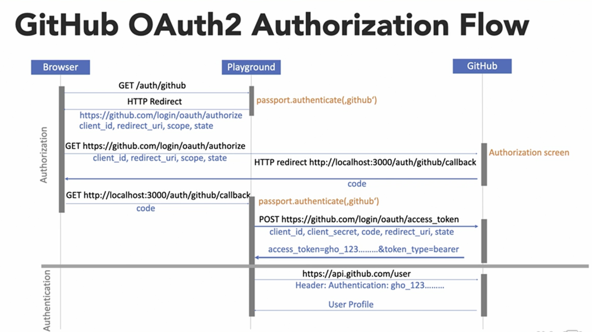

# Web Security with Node.js

Throughout this project, we will implement authentication and authorization in web applications using node.js and passport.js. We will understand how to secure a Node.js application using MongoDB for database management and Passport.js for handling user authentication and authorization. The module also covers the integration of single sign-on (SSO) functionality using GitHub OAuth2.



## Module Overview

The content is divided into several sections, each designed to build on the knowledge gained in the previous section. Please checkout to the appropriate branch for more information. Here's a breakdown of what each section covers:

- Branch `main`: This branch contains the initial setup of the project and the basic structure of the application.
  You should set up mongodb using docker and install the dependencies using `npm install`.

To get started with the playground, you need to install the following packages:

```bash
# Install the required packages
npm install

# Create a data folder to store the MongoDB data
mkdir data

# Pull the MongoDB Docker image and run the MongoDB container
docker pull mongo
docker run -d -p 37017:27017 --name mongodb -v ./data:/data/db mongo
```

Start the server using `npm run dev` and navigate to `http://localhost:3000` in your browser.

And then you are good to go.

- Branch `user registration`: This branch covers how to implement user registration and management functionality

  - **Registering New Users**: Covers how to implement user registration functionality.
  - **Why Plaintext Passwords Are Bad**: Discusses the security risks associated with storing passwords in plaintext.
  - **Hashing and Validating Passwords with bcrypt**: Shows how to securely store passwords using bcrypt hashing.
  - **Implementing Login and Logout**: Teaches how to add login and logout capabilities to the application.
  - **Deserializing the Logged In User from the Database**: Explains how to retrieve user information from the database upon login.
  - **Offer Remember Me**: Adds a "Remember Me" feature for user convenience.
  - **Require User Verification**: Implements email verification for new users.
  - **Resetting Passwords & Implementing the Password Reset Flow**: Guides through the process of allowing users to reset their forgotten passwords.

- Branch `authentication-passport`: This branch covers how to implement authentication and authorization in web applications using passport and JWT tokens.

  - **Introduction to Passport.js**: Introduces the Passport.js library and its role in authentication.
  - **Setting Up Passport.js for Local Authentication**: Demonstrates how to set up Passport.js for local authentication.
  - **Implementing JWT Authentication**: Shows how to implement JWT-based authentication.
  - **Protecting Routes with JWT Authentication**: Explains how to protect routes using JWT authentication.
  - **Implementing Role-Based Access Control**: Guides through the process of implementing role-based access control.
  - **Implementing User Profile and User Management**: Demonstrates how to implement user profile and user management functionality.

- Branch `sso-social`: This branch covers how to integrate single sign-on (SSO) functionality using GitHub OAuth2. It covers advanced Authentication Techniques and workflow that are essential for building secure and user-friendly web services with social login.
  - **Authentication, Authorization, and Single Sign-On (SSO)**: Introduces the concepts of authentication vs. authorization and the role of SSO.
  - **The GitHub OAuth2 Authorization (and Authentication) Flow**: Details how to integrate GitHub OAuth2 for authentication.
  - **Prepare Passport.js for GitHub OAuth2 & Extend the Application for Single Sign-On**: Demonstrates how to set up and integrate Passport.js for handling GitHub OAuth2.
  - **Finalize and Test the Single Sign-On Flow**: Concludes the module with final touches and testing of the SSO implementation.

## Conclusion

By the end of project, we will have a comprehensive understanding of how to implement secure authentication and authorization in their web applications, including using OAuth2 for single sign-on.
