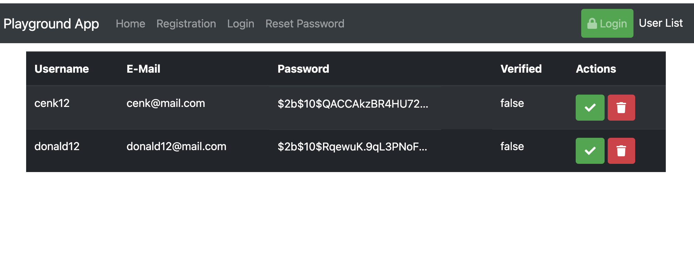

```bash
mkdir data
docker pull mongo
docker run -d -p 37017:27017 --name mongodb -v ./data:/data/db mongo
```

Start the server using `npm run dev` and navigate to `http://localhost:3000` in your browser.

In this playground, we will hash and validate the password using bcrypt. We would like to ensure that the password is hashed and stored securely in the database. We will use mongo pre-hook savers to hash the password before saving it to the database and then bcrypt compare method to validate the password.

```bash
npm install bcrypt
```

After hashing the password, we will use the bcrypt compare method to validate the password. If the password is valid, we will return the user details. If the password is invalid, we will return an error message.


