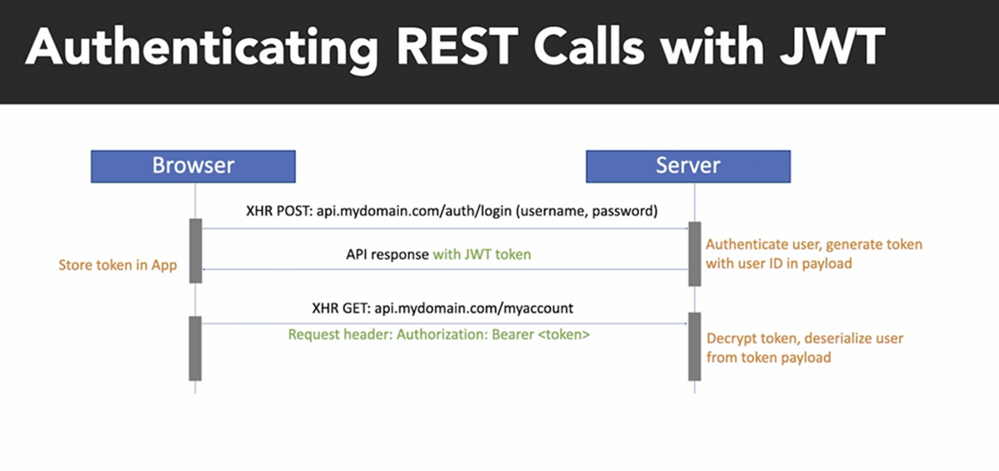
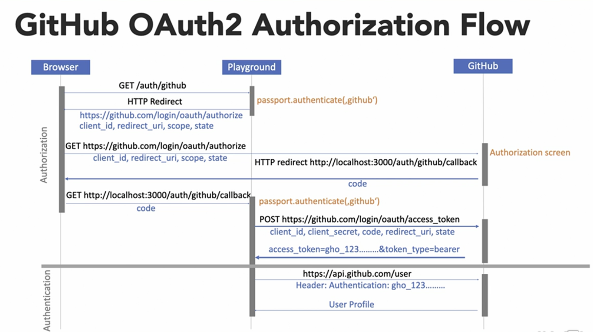

In this playground, we will hash and validate the password using bcrypt. We would like to ensure that the password is hashed and stored securely in the database. We will use mongo pre-hook savers to hash the password before saving it to the database and then bcrypt compare method to validate the password.

```bash
npm install bcrypt
```

After hashing the password, we will use the bcrypt compare method to validate the password. If the password is valid, we will return the user details. If the password is invalid, we will return an error message.


Regular cookie based authentication follows the following steps in the image:


Cookies and XHR calls based authentication follows the following steps in the image:


Authentication using JWT follows the following steps in the image:



JWT Tokens


## Authentication, Authorization, and Single Sign-On (SSO)





The profile looks like this when coming from the GitHub API:


